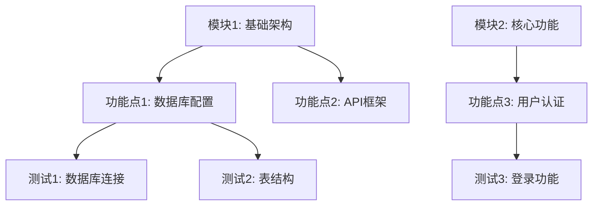

# CodeMCP 项目计划编写模板

## 模板说明

本模板用于指导 AI agent 为 CodeMCP 系统生成结构化的项目开发计划。模板遵循 CodeMCP 的四层数据模型：System → Block → Feature → Test。

### 使用指南

1. **填写项目信息**：根据实际项目需求填写各个部分
2. **保持结构化**：确保计划符合四层数据模型
3. **明确测试验证**：每个功能点必须有明确的测试命令
4. **设置合理优先级**：数字越小优先级越高（0为最高）
5. **考虑依赖关系**：标记任务间的依赖关系

---

## 1. 项目概述

### 1.1 项目名称
[填写项目名称，如："用户认证系统开发"]

### 1.2 项目描述
[简要描述项目目标和范围]

### 1.3 业务价值
[说明项目的业务价值和预期成果]

### 1.4 技术栈
- **后端语言**: [如：Python 3.9+]
- **Web框架**: [如：FastAPI]
- **数据库**: [如：PostgreSQL]
- **测试框架**: [如：pytest]
- **其他工具**: [如：Docker, Git]

### 1.5 成功标准
- [ ] 所有测试通过
- [ ] 代码覆盖率 > 80%
- [ ] 文档完整
- [ ] 部署就绪

---

## 2. 系统定义 (System)

### 2.1 系统基本信息
```yaml
system_name: "[系统名称，如：auth-system]"
description: "[系统描述]"
status: "active"  # active | archived
```

### 2.2 系统配置
```yaml
git_repository: "[Git仓库地址]"
git_branch: "[分支名称，如：main]"
environment: "[环境，如：development]"
```

---

## 3. 模块分解 (Blocks)

### 3.1 模块列表
每个模块代表一个独立的功能区域，按优先级排序（0为最高优先级）。

| 模块ID | 模块名称 | 描述 | 优先级 | 状态 |
|--------|----------|------|--------|------|
| B001 | [模块1名称] | [模块1描述] | 0 | pending |
| B002 | [模块2名称] | [模块2描述] | 1 | pending |
| B003 | [模块3名称] | [模块3描述] | 2 | pending |

### 3.2 模块详细定义

#### 模块: [模块名称] (ID: B001)
- **描述**: [详细描述模块功能和职责]
- **技术栈**: [使用的具体技术]
- **输入**: [模块输入]
- **输出**: [模块输出]
- **依赖模块**: [依赖的其他模块ID，如：无]
- **验收标准**: 
  - [ ] 功能完整实现
  - [ ] 单元测试覆盖
  - [ ] 集成测试通过
  - [ ] 文档齐全

---

## 4. 功能点定义 (Features)

### 4.1 功能点列表
每个功能点属于一个模块，包含具体的实现任务。

| 功能点ID | 所属模块 | 功能点名称 | 描述 | 测试命令 | 优先级 | 状态 |
|----------|----------|------------|------|----------|--------|------|
| F001 | B001 | [功能点1名称] | [功能点1描述] | [测试命令] | 0 | pending |
| F002 | B001 | [功能点2名称] | [功能点2描述] | [测试命令] | 1 | pending |
| F003 | B002 | [功能点3名称] | [功能点3描述] | [测试命令] | 0 | pending |

### 4.2 功能点详细定义

#### 功能点: [功能点名称] (ID: F001)
- **描述**: [详细描述功能点]
- **实现步骤**:
  1. [步骤1]
  2. [步骤2]
  3. [步骤3]
- **测试命令**: `[完整的测试命令，如：pytest tests/test_auth.py -k "test_login"]`
- **预期输出**: [测试成功时的预期输出]
- **失败处理**:
  - 重试次数: 3
  - 失败操作: 级联中止所属模块
  - 重新规划: 细化任务粒度
- **验收标准**:
  - [ ] 功能实现正确
  - [ ] 测试通过
  - [ ] 代码符合规范
  - [ ] 文档更新

---

## 5. 测试定义 (Tests)

### 5.1 测试列表
每个测试属于一个功能点，是具体的验证单元。

| 测试ID | 所属功能点 | 测试名称 | 命令 | 预期退出码 | 超时时间(s) |
|--------|------------|----------|------|------------|-------------|
| T001 | F001 | [测试1名称] | [具体命令] | 0 | 30 |
| T002 | F001 | [测试2名称] | [具体命令] | 0 | 30 |
| T003 | F002 | [测试3名称] | [具体命令] | 0 | 60 |

### 5.2 测试详细定义

#### 测试: [测试名称] (ID: T001)
- **描述**: [测试目的和验证内容]
- **命令**: `[完整的执行命令]`
- **环境要求**:
  - [ ] 数据库连接
  - [ ] 网络访问
  - [ ] 文件权限
  - [ ] 依赖服务
- **验证点**:
  - [ ] 功能正确性
  - [ ] 性能要求
  - [ ] 错误处理
  - [ ] 边界条件
- **失败处理**:
  - 自动重试: 是
  - 最大重试次数: 3
  - 重试延迟: 5秒

---

## 6. 优先级和依赖关系

### 6.1 整体优先级


### 6.2 关键路径
1. B001 → F001 → T001/T002 (基础架构)
2. B001 → F002 → [相关测试] (API框架)
3. B002 → F003 → T003 (核心功能)

### 6.3 风险评估
| 风险项 | 影响程度 | 发生概率 | 缓解措施 |
|--------|----------|----------|----------|
| [风险1] | 高/中/低 | 高/中/低 | [缓解措施] |
| [风险2] | 高/中/低 | 高/中/低 | [缓解措施] |

---

## 7. 执行计划

### 7.1 阶段划分
- **阶段1: 基础搭建** (预计: X天)
  - [ ] 完成模块 B001
  - [ ] 通过测试 T001, T002
  
- **阶段2: 核心开发** (预计: Y天)
  - [ ] 完成模块 B002
  - [ ] 通过测试 T003
  
- **阶段3: 集成测试** (预计: Z天)
  - [ ] 端到端测试
  - [ ] 性能测试
  - [ ] 安全测试

### 7.2 资源需求
- **开发环境**: [环境要求]
- **测试环境**: [环境要求]
- **部署环境**: [环境要求]
- **人员配置**: [角色和数量]

### 7.3 时间估算
| 任务 | 乐观时间 | 可能时间 | 悲观时间 | 最终估算 |
|------|----------|----------|----------|----------|
| B001 | X小时 | Y小时 | Z小时 | [估算] |
| B002 | X小时 | Y小时 | Z小时 | [估算] |
| 总计 | [总计] | [总计] | [总计] | [总计] |

---

## 8. 元数据和配置

### 8.1 计划元数据
```json
{
  "plan_name": "[计划名称]",
  "plan_version": "1.0",
  "created_by": "[创建者，如：planner-agent-001]",
  "created_at": "[创建时间]",
  "estimated_duration": "[总估算时长]",
  "total_blocks": "[模块总数]",
  "total_features": "[功能点总数]",
  "total_tests": "[测试总数]"
}
```

### 8.2 MCP协议配置
```json
{
  "mcp_protocol": "jsonrpc_2.0",
  "server_url": "http://localhost:8000",
  "client_type": "planner",
  "timeout": 30,
  "max_retries": 3
}
```

### 8.3 监控配置
```yaml
monitoring:
  enabled: true
  metrics:
    - execution_time
    - success_rate
    - failure_rate
    - retry_count
  alerts:
    - on_failure: true
    - on_timeout: true
    - on_high_retry: true
```

---

## 9. 附录

### 9.1 术语表
| 术语 | 定义 |
|------|------|
| System | 业务领域或项目实例 |
| Block | 功能模块，属于某个System |
| Feature | 功能点，属于某个Block |
| Test | 测试单元，属于某个Feature |
| MCP | Model Context Protocol，CodeMCP通信协议 |

### 9.2 参考文档
- [CodeMCP 架构设计](architecture_design.md)
- [MCP 协议接口](mcp_protocol_interface.md)
- [数据模型设计](data_model_design.md)
- [状态机设计](state_machine_design.md)

### 9.3 变更记录
| 版本 | 日期 | 修改内容 | 修改人 |
|------|------|----------|--------|
| 1.0 | [日期] | 初始版本 | [姓名] |

---

## 模板使用示例

### 示例：用户认证系统
```yaml
# 系统定义
system_name: "user-auth-system"
description: "用户认证和授权管理系统"

# 模块定义
blocks:
  - id: "B001"
    name: "数据库层"
    description: "用户数据存储和访问"
    priority: 0
    features:
      - id: "F001"
        name: "创建用户表"
        description: "设计并创建 users 表"
        test_command: "pytest tests/test_user_model.py"
        priority: 0
        tests:
          - id: "T001"
            name: "测试表结构"
            command: "pytest tests/test_user_model.py::test_table_structure"
            expected_exit_code: 0
```

### JSON-RPC 请求示例
```json
{
  "jsonrpc": "2.0",
  "id": "plan-create-001",
  "method": "mcp.planner.create_plan",
  "params": {
    "system_id": 1,
    "plan_name": "用户认证模块开发",
    "plan_version": "1.0",
    "blocks": [
      {
        "name": "数据库层",
        "description": "用户表和数据访问",
        "priority": 0,
        "features": [
          {
            "name": "创建用户表",
            "description": "设计并创建 users 表",
            "test_command": "pytest tests/test_user_model.py",
            "priority": 0
          }
        ]
      }
    ],
    "metadata": {
      "created_by": "planner-agent-001",
      "git_repo": "https://github.com/example/project",
      "git_branch": "main"
    }
  }
}
```

---

**模板结束**

*注意：使用本模板时，请根据实际项目需求调整各部分内容，确保计划的完整性和可执行性。*