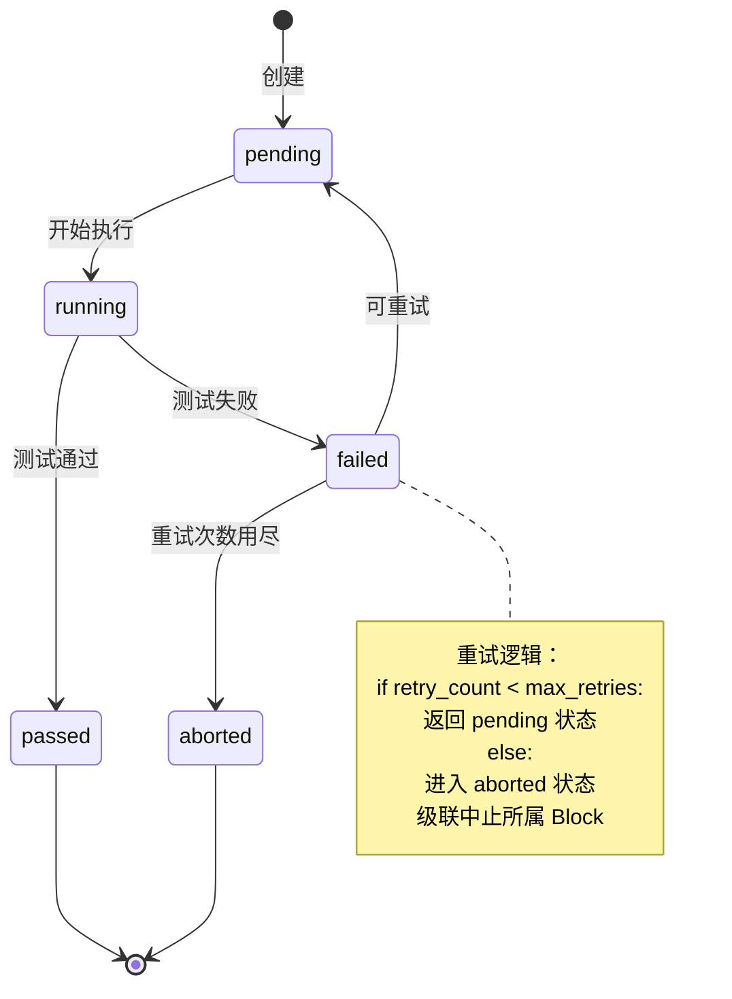
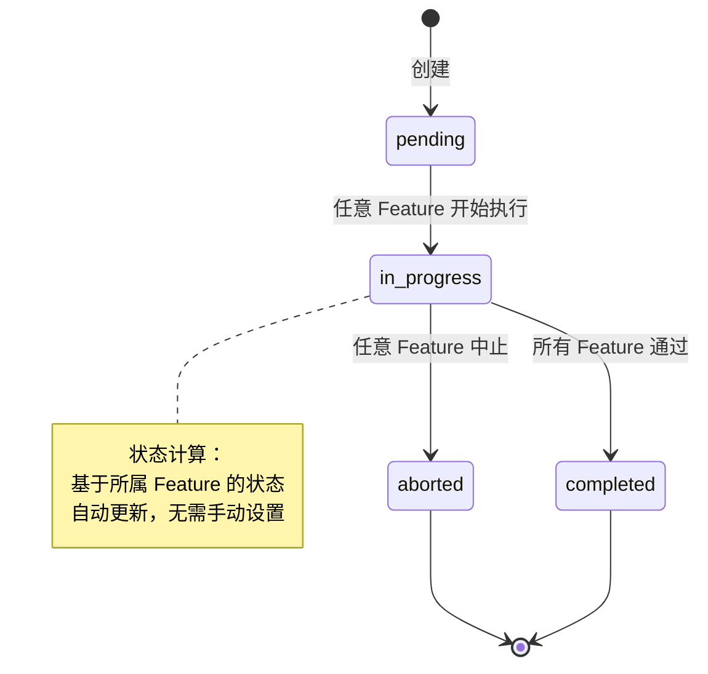

# Gateway 核心状态机逻辑设计

## 概述
Gateway 的状态机负责管理整个系统的任务生命周期，包括任务调度、执行窗口管理、失败处理和状态流转。本文档详细描述状态机的设计和工作原理。

## 状态机架构

### 核心组件
```
┌─────────────────────────────────────────────────────────────┐
│                    Gateway State Machine                     │
├─────────────────────────────────────────────────────────────┤
│  Task Scheduler        │  Window Manager    │  Failure Handler│
│  • 任务优先级排序      │  • 执行窗口控制    │  • 失败检测     │
│  • 状态流转控制        │  • 并发限制        │  • 重试逻辑     │
│  • 事件触发            │  • 资源分配        │  • 级联中止     │
└──────────────┬──────────────────────────────┬──────────────┘
               │                              │
        ┌──────▼──────┐                ┌──────▼──────┐
        │   Database  │                │   Executor  │
        │   Layer     │                │   Interface │
        └─────────────┘                └─────────────┘
```

## 状态定义

### 1. System 状态
```python
SystemStatus = Literal["active", "archived"]
```

### 2. Block 状态
```python
BlockStatus = Literal["pending", "in_progress", "completed", "aborted"]
```

### 3. Feature 状态
```python
FeatureStatus = Literal["pending", "running", "passed", "failed", "aborted"]
```

### 4. Test 状态
```python
TestStatus = Literal["pending", "running", "passed", "failed"]
```

## 状态流转规则

### Feature 状态机


### Block 状态机


## 核心状态机实现

### StateMachine 基类
```python
# src/codemcp/core/state_machine.py
from abc import ABC, abstractmethod
from enum import Enum
from typing import Any, Dict, List, Optional, Type, TypeVar
from dataclasses import dataclass
from datetime import datetime

from sqlalchemy.orm import Session

T = TypeVar('T', bound='StateMachine')


@dataclass
class Transition:
    """状态转移定义"""
    from_state: str
    to_state: str
    condition: Optional[str] = None
    action: Optional[str] = None
    description: Optional[str] = None


class StateMachine(ABC):
    """状态机基类"""
    
    def __init__(self, current_state: str):
        self.current_state = current_state
        self.history: List[Dict[str, Any]] = []
        self.transitions: List[Transition] = []
        
    def add_transition(
        self,
        from_state: str,
        to_state: str,
        condition: Optional[str] = None,
        action: Optional[str] = None,
        description: Optional[str] = None
    ) -> None:
        """添加状态转移"""
        transition = Transition(
            from_state=from_state,
            to_state=to_state,
            condition=condition,
            action=action,
            description=description
        )
        self.transitions.append(transition)
    
    def can_transition(self, to_state: str, context: Dict[str, Any] = None) -> bool:
        """检查是否可以转移到目标状态"""
        if context is None:
            context = {}
        
        for transition in self.transitions:
            if (transition.from_state == self.current_state and 
                transition.to_state == to_state):
                
                # 检查条件
                if transition.condition:
                    if not self._evaluate_condition(transition.condition, context):
                        return False
                
                return True
        
        return False
    
    def transition(self, to_state: str, context: Dict[str, Any] = None) -> bool:
        """执行状态转移"""
        if context is None:
            context = {}
        
        if not self.can_transition(to_state, context):
            return False
        
        # 记录历史
        self.history.append({
            "timestamp": datetime.utcnow(),
            "from_state": self.current_state,
            "to_state": to_state,
            "context": context.copy()
        })
        
        # 执行转移动作
        for transition in self.transitions:
            if (transition.from_state == self.current_state and 
                transition.to_state == to_state):
                
                if transition.action:
                    self._execute_action(transition.action, context)
        
        # 更新状态
        old_state = self.current_state
        self.current_state = to_state
        
        # 触发状态变更事件
        self.on_state_changed(old_state, to_state, context)
        
        return True
    
    def _evaluate_condition(self, condition: str, context: Dict[str, Any]) -> bool:
        """评估条件表达式"""
        # 简单的条件评估实现
        # 实际实现可以使用更复杂的表达式引擎
        try:
            # 将上下文变量注入到评估环境中
            env = {**context, **self.__dict__}
            return eval(condition, {"__builtins__": {}}, env)
        except:
            return False
    
    def _execute_action(self, action: str, context: Dict[str, Any]) -> None:
        """执行动作"""
        # 简单的动作执行
        # 实际实现可以调用方法或执行代码
        try:
            env = {**context, **self.__dict__}
            exec(action, {"__builtins__": {}}, env)
        except Exception as e:
            self.on_action_error(action, e, context)
    
    @abstractmethod
    def on_state_changed(self, old_state: str, new_state: str, context: Dict[str, Any]) -> None:
        """状态变更回调"""
        pass
    
    def on_action_error(self, action: str, error: Exception, context: Dict[str, Any]) -> None:
        """动作执行错误回调"""
        pass
```

### FeatureStateMachine 实现
```python
# src/codemcp/core/feature_state_machine.py
from typing import Dict, Any
from datetime import datetime

from .state_machine import StateMachine
from ..models.feature import Feature
from ..models.block import Block


class FeatureStateMachine(StateMachine):
    """Feature 状态机"""
    
    def __init__(self, feature: Feature):
        super().__init__(feature.status)
        self.feature = feature
        
        # 定义状态转移
        self._define_transitions()
    
    def _define_transitions(self) -> None:
        """定义状态转移规则"""
        
        # pending -> running
        self.add_transition(
            from_state="pending",
            to_state="running",
            condition="context.get('executor_id') is not None",
            action="self._on_start_execution(context)",
            description="开始执行任务"
        )
        
        # running -> passed
        self.add_transition(
            from_state="running",
            to_state="passed",
            condition="context.get('exit_code') == 0",
            action="self._on_test_passed(context)",
            description="测试通过"
        )
        
        # running -> failed
        self.add_transition(
            from_state="running",
            to_state="failed",
            condition="context.get('exit_code') != 0",
            action="self._on_test_failed(context)",
            description="测试失败"
        )
        
        # failed -> pending (重试)
        self.add_transition(
            from_state="failed",
            to_state="pending",
            condition="self.feature.retry_count < self.feature.max_retries",
            action="self._on_prepare_retry(context)",
            description="准备重试"
        )
        
        # failed -> aborted
        self.add_transition(
            from_state="failed",
            to_state="aborted",
            condition="self.feature.retry_count >= self.feature.max_retries",
            action="self._on_abort_feature(context)",
            description="中止任务（重试次数用尽）"
        )
        
        # * -> aborted (手动中止)
        self.add_transition(
            from_state="*",
            to_state="aborted",
            condition="context.get('manual_abort') == True",
            action="self._on_manual_abort(context)",
            description="手动中止"
        )
    
    def _on_start_execution(self, context: Dict[str, Any]) -> None:
        """开始执行动作"""
        self.feature.mark_as_started()
        self.feature.started_at = datetime.utcnow()
        
        # 记录执行者信息
        if 'executor_id' in context:
            self.feature.executor_id = context['executor_id']
    
    def _on_test_passed(self, context: Dict[str, Any]) -> None:
        """测试通过动作"""
        duration = context.get('duration')
        self.feature.mark_as_completed(success=True, duration=duration)
        
        # 更新测试结果
        if 'test_result' in context:
            self.feature.last_test_result = context['test_result']
    
    def _on_test_failed(self, context: Dict[str, Any]) -> None:
        """测试失败动作"""
        duration = context.get('duration')
        self.feature.mark_as_completed(success=False, duration=duration)
        self.feature.retry_count += 1
        
        # 记录错误信息
        if 'error_details' in context:
            self.feature.last_error = context['error_details']
    
    def _on_prepare_retry(self, context: Dict[str, Any]) -> None:
        """准备重试动作"""
        self.feature.prepare_for_retry()
        
        # 重置相关状态
        self.feature.started_at = None
        self.feature.completed_at = None
        self.feature.duration = None
    
    def _on_abort_feature(self, context: Dict[str, Any]) -> None:
        """中止任务动作"""
        # 标记Feature为中止
        self.feature.status = "aborted"
        self.feature.completed_at = datetime.utcnow()
        
        # 级联中止所属Block
        self._abort_block(context)
    
    def _on_manual_abort(self, context: Dict[str, Any]) -> None:
        """手动中止动作"""
        reason = context.get('reason', '手动中止')
        self.feature.status = "aborted"
        self.feature.completed_at = datetime.utcnow()
        self.feature.abort_reason = reason
        
        # 级联中止所属Block
        self._abort_block(context)
    
    def _abort_block(self, context: Dict[str, Any]) -> None:
        """中止所属Block"""
        block = self.feature.block
        
        # 中止Block
        block.status = "aborted"
        block.completed_at = datetime.utcnow()
        
        # 中止Block下所有其他pending/running的Feature
        for other_feature in block.features:
            if other_feature.id != self.feature.id and other_feature.status in ["pending", "running"]:
                other_feature.status = "aborted"
                other_feature.completed_at = datetime.utcnow()
                other_feature.abort_reason = f"级联中止：{self.feature.name} 失败"
    
    def on_state_changed(self, old_state: str, new_state: str, context: Dict[str, Any]) -> None:
        """状态变更回调"""
        # 记录状态变更日志
        from ..utils.logging import get_logger
        logger = get_logger(__name__)
        
        logger.info(
            f"Feature状态变更: {self.feature.id} ({self.feature.name}) "
            f"{old_state} -> {new_state}",
            extra={
                "feature_id": self.feature.id,
                "feature_name": self.feature.name,
                "old_state": old_state,
                "new_state": new_state,
                "context": context
            }
        )
        
        # 触发状态变更事件
        self._emit_state_change_event(old_state, new_state, context)
    
    def _emit_state_change_event(self, old_state: str, new_state: str, context: Dict[str, Any]) -> None:
        """触发状态变更事件"""
        from ..api.events import EventBus
        
        event_data = {
            "feature_id": self.feature.id,
            "feature_name": self.feature.name,
            "block_id": self.feature.block_id,
            "block_name": self.feature.block.name,
            "system_id": self.feature.block.system_id,
            "system_name": self.feature.block.system.name,
            "old_state": old_state,
            "new_state": new_state,
            "timestamp": datetime.utcnow().isoformat(),
            "context": context
        }
        
        EventBus.emit("feature_state_changed", event_data)
```

## 任务调度器

### TaskScheduler 实现
```python
# src/codemcp/core/task_scheduler.py
from typing import List, Optional, Dict, Any
from datetime import datetime, timedelta
from dataclasses import dataclass
from enum import Enum
import asyncio

from sqlalchemy.orm import Session
from sqlalchemy import select, and_, or_, desc, func

from ..models.feature import Feature
from ..models.block import Block
from ..models.system import System
from .feature_state_machine import FeatureStateMachine


class SchedulerStatus(Enum):
    """调度器状态"""
    IDLE = "idle"
    RUNNING = "running"
    PAUSED = "paused"
    STOPPED = "stopped"


@dataclass
class SchedulingPolicy:
    """调度策略配置"""
    window_size: int = 5  # 执行窗口大小
    max_retries: int = 3  # 最大重试次数
    priority_weight: float = 0.7  # 优先级权重
    age_weight: float = 0.3  # 等待时间权重
    max_age_days: int = 7  # 最大等待天数
    check_interval: int = 10  # 检查间隔（秒）


class TaskScheduler:
    """任务调度器"""
    
    def __init__(self, db: Session, policy: Optional[SchedulingPolicy] = None):
        self.db = db
        self.policy = policy or SchedulingPolicy()
        self.status = SchedulerStatus.IDLE
        self.window: List[Feature] = []
        self.running_tasks: Dict[int, asyncio.Task] = {}
        self._stop_event = asyncio.Event()
        
    async def start(self) -> None:
        """启动调度器"""
        if self.status != SchedulerStatus.IDLE:
            raise RuntimeError(f"调度器状态为 {self.status}，无法启动")
        
        self.status = SchedulerStatus.RUNNING
        self._stop_event.clear()
        
        # 启动调度循环
        asyncio.create_task(self._scheduling_loop())
        
        from ..utils.logging import get_logger
        logger = get_logger(__name__)
        logger.info("任务调度器已启动")
    
    async def stop(self) -> None:
        """停止调度器"""
        self.status = SchedulerStatus.STOPPED
        self._stop_event.set()
        
        # 等待所有运行中的任务完成
        for task in self.running_tasks.values():
            task.cancel()
        
        await asyncio.gather(*self.running_tasks.values(), return_exceptions=True)
        
        from ..utils.logging import get_logger
        logger = get_logger(__name__)
        logger.info("任务调度器已停止")
    
    async def pause(self) -> None:
        """暂停调度器"""
        if self.status == SchedulerStatus.RUNNING:
            self.status = SchedulerStatus.PAUSED
            from ..utils.logging import get_logger
            logger = get_logger(__name__)
            logger.info("任务调度器已暂停")
    
    async def resume(self) -> None:
        """恢复调度器"""
        if self.status == SchedulerStatus.PAUSED:
            self.status = SchedulerStatus.RUNNING
            from ..utils.logging import get_logger
            logger = get_logger(__name__)
            logger.info("任务调度器已恢复")
    
    async def _scheduling_loop(self) -> None:
        """调度循环"""
        while self.status == SchedulerStatus.RUNNING and not self._stop_event.is_set():
            try:
                # 1. 检查执行窗口
                await self._check_window()
                
                # 2. 填充执行窗口
                await self._fill_window()
                
                # 3. 调度窗口中的任务
                await self._schedule_tasks()
                
                # 4. 等待下一次检查
                await asyncio.sleep(self.policy.check_interval)
                
            except asyncio.CancelledError:
                break
            except Exception as e:
                from ..utils.logging import get_logger
                logger = get_logger(__name__)
                logger.error(f"调度循环错误: {e}", exc_info=True)
                await asyncio.sleep(self.policy.check_interval * 2)
    
    async def _check_window(self) -> None:
        """检查执行窗口状态"""
        # 移除已完成或失败的任务