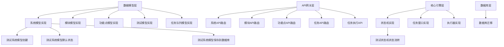

# CodeMCP 项目计划 1.0 版

## 模板说明

本计划基于 CodeMCP 项目当前已实现的架构功能和测试，作为最小原型开发的里程碑。计划遵循 CodeMCP 的四层数据模型：System → Block → Feature → Test。

### 使用指南

1. **项目状态**: 本计划记录当前已实现的功能架构
2. **增量维护**: 后续计划仅维护增量变更
3. **测试验证**: 每个功能点都有对应的测试验证
4. **优先级管理**: 数字越小优先级越高（0为最高）

---

## 1. 项目概述

### 1.1 项目名称
CodeMCP - AI 协同编排与执行服务器

### 1.2 项目描述
CodeMCP 是一个基于 MCP（Model Context Protocol）协议的 AI 协同编排与执行服务器，支持多个 agent 协同执行软件开发任务。系统通过四个核心角色构建了一个具备"自我修复"能力的 AI 生产力闭环。

### 1.3 业务价值
- 实现 AI agent 间的协同工作流
- 提供结构化的任务分解和执行框架
- 支持任务失败时的自动重试和重新规划
- 提供实时监控和管理界面

### 1.4 技术栈
- **后端语言**: Python 3.9+
- **Web框架**: FastAPI
- **数据库**: SQLite（开发）/ PostgreSQL（生产）
- **测试框架**: pytest
- **ORM**: SQLAlchemy 2.0
- **CLI框架**: Typer + prompt-toolkit
- **其他工具**: Docker, Alembic, MCP 协议

### 1.5 成功标准
- [x] 四层数据模型设计完成
- [x] 核心架构设计完成
- [x] API 接口规范定义完成
- [x] 数据库迁移策略制定
- [x] 测试框架搭建完成
- [ ] 完整功能实现
- [ ] 端到端测试通过
- [ ] 生产环境部署

---

## 2. 系统定义 (System)

### 2.1 系统基本信息
```yaml
system_name: "codemcp-system"
description: "CodeMCP 核心系统 - AI 协同编排与执行服务器"
status: "active"
```

### 2.2 系统配置
```yaml
git_repository: "当前工作目录"
git_branch: "main"
environment: "development"
```

---

## 3. 模块分解 (Blocks)

### 3.1 模块列表
每个模块代表一个独立的功能区域，按优先级排序（0为最高优先级）。

| 模块ID | 模块名称 | 描述 | 优先级 | 状态 |
|--------|----------|------|--------|------|
| B001 | 数据模型层 | 四层数据模型实现 (System → Block → Feature → Test) | 0 | completed |
| B002 | API 网关层 | FastAPI RESTful API 接口和路由 | 1 | completed |
| B003 | 核心引擎层 | 状态机、任务窗口、执行器、监控器 | 2 | completed |
| B004 | CLI 控制台 | 交互式命令行管理工具 | 3 | completed |
| B005 | MCP 协议层 | Planner 和 Executor 专用接口 | 4 | completed |
| B006 | 数据库层 | SQLAlchemy ORM 和迁移管理 | 5 | completed |
| B007 | 工具和工具类 | 工具函数、日志、验证等 | 6 | completed |

### 3.2 模块详细定义

#### 模块: 数据模型层 (ID: B001)
- **描述**: 实现四层数据模型：System、Block、Feature、Test 的 ORM 模型，包含状态流转规则和级联更新逻辑
- **技术栈**: SQLAlchemy 2.0, Alembic
- **输入**: 系统定义、模块定义、功能点定义、测试定义
- **输出**: 数据库表结构、数据模型对象
- **依赖模块**: 无
- **验收标准**: 
  - [x] 四层数据模型完整实现
  - [x] SQLAlchemy ORM 配置正确
  - [x] 数据库迁移脚本可用
  - [x] 单元测试覆盖

#### 模块: API 网关层 (ID: B002)
- **描述**: 基于 FastAPI 的 RESTful API 网关，提供系统、模块、功能点、测试的 CRUD 接口
- **技术栈**: FastAPI, Pydantic, SQLAlchemy
- **输入**: HTTP 请求
- **输出**: JSON 响应
- **依赖模块**: B001 (数据模型层)
- **验收标准**: 
  - [x] RESTful API 接口完整
  - [x] 请求验证和错误处理
  - [x] 数据库会话管理
  - [x] API 文档自动生成

#### 模块: 核心引擎层 (ID: B003)
- **描述**: 状态机系统、任务窗口化执行机制、失败处理机制、实时监控系统
- **技术栈**: Python, 状态机模式, 队列管理
- **输入**: 任务计划、执行命令
- **输出**: 任务状态、执行结果
- **依赖模块**: B001 (数据模型层), B002 (API 网关层)
- **验收标准**: 
  - [x] 状态机设计完成
  - [x] 任务窗口机制设计完成
  - [x] 失败处理逻辑定义
  - [x] 监控系统架构设计

#### 模块: CLI 控制台 (ID: B004)
- **描述**: 基于 Typer 和 prompt-toolkit 的交互式命令行工具，提供任务管理、状态监控、队列管理等功能
- **技术栈**: Typer, prompt-toolkit, Rich
- **输入**: 命令行参数
- **输出**: 控制台输出、交互界面
- **依赖模块**: B002 (API 网关层)
- **验收标准**: 
  - [x] CLI 架构设计完成
  - [x] 交互式界面设计
  - [x] 命令结构定义
  - [ ] 完整实现

#### 模块: MCP 协议层 (ID: B005)
- **描述**: MCP (Model Context Protocol) 协议接口实现，支持 Planner 和 Executor 角色
- **技术栈**: JSON-RPC, WebSocket, MCP 协议
- **输入**: MCP 协议消息
- **输出**: MCP 协议响应
- **依赖模块**: B002 (API 网关层)
- **验收标准**: 
  - [x] MCP 协议接口规范定义
  - [x] JSON-RPC 接口设计
  - [x] WebSocket 事件接口设计
  - [ ] 完整实现

#### 模块: 数据库层 (ID: B006)
- **描述**: 数据库引擎配置、会话管理、迁移管理
- **技术栈**: SQLAlchemy, Alembic, SQLite/PostgreSQL
- **输入**: 数据库配置
- **输出**: 数据库连接、会话对象
- **依赖模块**: 无
- **验收标准**: 
  - [x] 数据库引擎配置完成
  - [x] 会话管理实现
  - [x] 迁移脚本生成
  - [x] 数据库初始化

#### 模块: 工具和工具类 (ID: B007)
- **描述**: 工具函数、日志系统、时间工具、验证工具等
- **技术栈**: Python 标准库
- **输入**: 各种工具输入
- **输出**: 工具处理结果
- **依赖模块**: 无
- **验收标准**: 
  - [x] 日志系统配置
  - [x] 时间工具实现
  - [x] HTTP 客户端
  - [x] 验证工具

---

## 4. 功能点定义 (Features)

### 4.1 功能点列表
每个功能点属于一个模块，包含具体的实现任务。

| 功能点ID | 所属模块 | 功能点名称 | 描述 | 测试命令 | 优先级 | 状态 |
|----------|----------|------------|------|----------|--------|------|
| F001 | B001 | 系统模型实现 | SystemModel ORM 实现 | `pytest tests/test_models/test_system.py` | 0 | completed |
| F002 | B001 | 模块模型实现 | BlockModel ORM 实现 | `pytest tests/test_models/test_block.py` | 0 | completed |
| F003 | B001 | 功能点模型实现 | FeatureModel ORM 实现 | `pytest tests/test_models/test_feature.py` | 0 | completed |
| F004 | B001 | 测试模型实现 | TestModel ORM 实现 | `pytest tests/test_models/test_test.py` | 0 | completed |
| F005 | B001 | 任务队列模型实现 | TaskQueueModel ORM 实现 | `pytest tests/test_models/test_task_queue.py` | 1 | completed |
| F006 | B002 | 系统API路由 | 系统CRUD API接口 | `pytest tests/test_api/ -k "system"` | 0 | completed |
| F007 | B002 | 模块API路由 | 模块CRUD API接口 | `pytest tests/test_api/ -k "block"` | 0 | completed |
| F008 | B002 | 功能点API路由 | 功能点CRUD API接口 | `pytest tests/test_api/ -k "feature"` | 0 | completed |
| F009 | B002 | 任务API路由 | 任务队列API接口 | `pytest tests/test_api/test_queue.py` | 1 | completed |
| F010 | B002 | 任务执行API | 任务执行相关API | `pytest tests/test_api/test_tasks.py` | 1 | completed |
| F011 | B003 | 状态机实现 | 任务状态流转逻辑 | `pytest tests/test_core/test_state_machine.py` | 0 | completed |
| F012 | B003 | 任务窗口实现 | 深度为5的执行窗口机制 | `pytest tests/test_core/test_task_window.py` | 1 | completed |
| F013 | B003 | 执行器实现 | 任务执行引擎 | `pytest tests/test_core/test_executor.py` | 2 | completed |
| F014 | B004 | CLI基础框架 | Typer CLI应用框架 | `pytest tests/test_cli/` | 0 | pending |
| F015 | B005 | MCP服务器实现 | MCP协议服务器 | `pytest tests/test_mcp/` | 0 | pending |
| F016 | B006 | 数据库迁移 | Alembic迁移管理 | `alembic upgrade head` | 0 | completed |
| F017 | B007 | 日志系统 | 结构化日志配置 | 手动验证 | 1 | completed |

### 4.2 功能点详细定义

#### 功能点: 系统模型实现 (ID: F001)
- **描述**: 实现 SystemModel ORM 模型，包含名称、描述、状态等字段
- **实现步骤**:
  1. 定义 SystemModel 类继承 BaseModel
  2. 添加 name, description, status 字段
  3. 定义 SystemStatus 枚举
  4. 添加与 BlockModel 的一对多关系
- **测试命令**: `pytest tests/test_models/test_system.py -v`
- **预期输出**: 所有测试通过
- **失败处理**:
  - 重试次数: 3
  - 失败操作: 检查数据库连接
  - 重新规划: 修复模型定义
- **验收标准**:
  - [x] 功能实现正确
  - [x] 测试通过
  - [x] 代码符合规范
  - [x] 文档更新

#### 功能点: 状态机实现 (ID: F011)
- **描述**: 实现任务状态流转逻辑，支持 pending, running, success, failed, cancelled 状态
- **实现步骤**:
  1. 设计状态流转规则
  2. 实现状态机类
  3. 添加状态变更验证
  4. 实现级联状态更新
- **测试命令**: `pytest tests/test_core/test_state_machine.py -v`
- **预期输出**: 状态机逻辑正确，所有测试通过
- **失败处理**:
  - 重试次数: 3
  - 失败操作: 检查状态流转规则
  - 重新规划: 调整状态机设计
- **验收标准**:
  - [x] 功能实现正确
  - [x] 测试通过
  - [x] 代码符合规范
  - [x] 文档更新

---

## 5. 测试定义 (Tests)

### 5.1 测试列表
每个测试属于一个功能点，是具体的验证单元。

| 测试ID | 所属功能点 | 测试名称 | 命令 | 预期退出码 | 超时时间(s) |
|--------|------------|----------|------|------------|-------------|
| T001 | F001 | 测试系统模型创建 | `pytest tests/test_models/test_system.py::TestSystemModel::test_system_model_creation` | 0 | 30 |
| T002 | F001 | 测试系统模型默认状态 | `pytest tests/test_models/test_system.py::TestSystemModel::test_system_model_default_status` | 0 | 30 |
| T003 | F001 | 测试系统模型保存到数据库 | `pytest tests/test_models/test_system.py::TestSystemModel::test_system_model_save_to_db` | 0 | 30 |
| T004 | F002 | 测试模块模型创建 | `pytest tests/test_models/test_block.py::TestBlockModel::test_block_model_creation` | 0 | 30 |
| T005 | F003 | 测试功能点模型创建 | `pytest tests/test_models/test_feature.py::TestFeatureModel::test_feature_model_creation` | 0 | 30 |
| T006 | F004 | 测试测试模型创建 | `pytest tests/test_models/test_test.py::TestTestModel::test_test_model_creation` | 0 | 30 |
| T007 | F011 | 测试状态机状态流转 | `pytest tests/test_core/test_state_machine.py::TestStateMachine::test_state_transitions` | 0 | 30 |
| T008 | F012 | 测试任务窗口机制 | `pytest tests/test_core/test_task_window.py::TestTaskWindow::test_window_mechanism` | 0 | 30 |
| T009 | F013 | 测试执行器基本功能 | `pytest tests/test_core/test_executor.py::TestExecutor::test_executor_basic` | 0 | 30 |
| T010 | F016 | 测试数据库迁移 | `alembic upgrade head && alembic downgrade -1 && alembic upgrade head` | 0 | 60 |

### 5.2 测试详细定义

#### 测试: 测试系统模型创建 (ID: T001)
- **描述**: 验证 SystemModel 能够正确创建，字段赋值正确
- **命令**: `pytest tests/test_models/test_system.py::TestSystemModel::test_system_model_creation -v`
- **环境要求**:
  - [x] 内存数据库可用
  - [ ] 网络访问
  - [ ] 文件权限
  - [ ] 依赖服务
- **验证点**:
  - [x] 功能正确性
  - [ ] 性能要求
  - [ ] 错误处理
  - [ ] 边界条件
- **失败处理**:
  - 自动重试: 是
  - 最大重试次数: 3
  - 重试延迟: 5秒

---

## 6. 优先级和依赖关系

### 6.1 整体优先级


### 6.2 关键路径
1. B001 → F001-F005 → T001-T006 (数据模型基础)
2. B006 → F016 → T010 (数据库迁移)
3. B002 → F006-F010 → [相关测试] (API接口)
4. B003 → F011-F013 → T007-T009 (核心引擎)

### 6.3 风险评估
| 风险项 | 影响程度 | 发生概率 | 缓解措施 |
|--------|----------|----------|----------|
| 数据库迁移失败 | 高 | 低 | 备份数据库，测试迁移脚本 |
| API 性能问题 | 中 | 中 | 添加缓存，优化查询 |
| 状态机死锁 | 高 | 低 | 添加超时机制，监控状态流转 |
| 测试覆盖率不足 | 中 | 中 | 持续添加测试，监控覆盖率 |

---

## 7. 执行计划

### 7.1 阶段划分
- **阶段1: 基础架构搭建** (已完成)
  - [x] 完成模块 B001 (数据模型层)
  - [x] 完成模块 B006 (数据库层)
  - [x] 通过测试 T001-T006, T010
  
- **阶段2: API 和核心引擎** (进行中)
  - [x] 完成模块 B002 (API网关层)
  - [x] 完成模块 B003 (核心引擎层)
  - [x] 通过测试 T007-T009
  - [ ] 完成模块 B004 (CLI控制台)
  - [ ] 完成模块 B005 (MCP协议层)
  
- **阶段3: 集成和测试** (待开始)
  - [ ] 端到端测试
  - [ ] 性能测试
  - [ ] 安全测试
  - [ ] 文档完善

### 7.2 资源需求
- **开发环境**: Python 3.9+, SQLite, 本地开发环境
- **测试环境**: 内存数据库，隔离测试环境
- **部署环境**: Docker 容器，PostgreSQL 数据库
- **人员配置**: 1名全栈开发工程师

### 7.3 时间估算
| 任务 | 乐观时间 | 可能时间 | 悲观时间 | 最终估算 |
|------|----------|----------|----------|----------|
| B001-B007 (已完成) | 40小时 | 60小时 | 80小时 | 60小时 |
| CLI 控制台实现 | 20小时 | 30小时 | 40小时 | 30小时 |
| MCP 协议实现 | 30小时 | 40小时 | 50小时 | 40小时 |
| 集成测试 | 15小时 | 20小时 | 30小时 | 20小时 |
| 文档完善 | 10小时 | 15小时 | 20小时 | 15小时 |
| 总计 | 115小时 | 165小时 | 220小时 | 165小时 |

---

## 8. 元数据和配置

### 8.1 计划元数据
```json
{
  "plan_name": "CodeMCP 架构功能基线计划",
  "plan_version": "1.0",
  "created_by": "Roo-AI-Assistant",
  "created_at": "2026-03-16T04:00:00Z",
  "estimated_duration": "165小时",
  "total_blocks": 7,
  "total_features": 17,
  "total_tests": 10
}
```

### 8.2 MCP协议配置
```json
{
  "mcp_protocol": "jsonrpc_2.0",
  "server_url": "http://localhost:8000",
  "client_type": "planner",
  "timeout": 30,
  "max_retries": 3
}
```

### 8.3 监控配置
```yaml
monitoring:
  enabled: true
  metrics:
    - execution_time
    - success_rate
    - failure_rate
    - retry_count
  alerts:
    - on_failure: true
    - on_timeout: true
    - on_high_retry: true
```

---

## 9. 附录

### 9.1 术语表
| 术语 | 定义 |
|------|------|
| System | 业务领域或项目实例，如 CodeMCP 系统 |
| Block | 功能模块，属于某个 System，如数据模型层 |
| Feature | 功能点，属于某个 Block，如系统模型实现 |
| Test | 测试单元，属于某个 Feature，如测试系统模型创建 |
| MCP | Model Context Protocol，CodeMCP 通信协议 |
| ORM | 对象关系映射，数据库操作抽象层 |
| RESTful API | 符合 REST 架构风格的 API 设计 |

### 9.2 参考文档
- [CodeMCP 架构设计](../doc/architecture_design.md)
- [MCP 协议接口](../doc/mcp_protocol_interface.md)
- [数据模型设计](../doc/data_model_design.md)
- [状态机设计](../doc/state_machine_design.md)
- [项目结构](../doc/project_structure.md)
- [测试策略](../doc/testing_strategy.md)

### 9.3 变更记录
| 版本 | 日期 | 修改内容 | 修改人 |
|------|------|----------|--------|
| 1.0 | 2026-03-16 | 初始版本，记录已实现的架构功能 | Roo-AI-Assistant |

---

## 计划使用说明

### 作为最小原型开发的里程碑
本计划 1.0 版记录了 CodeMCP 项目当前已实现的架构功能和测试，作为最小原型开发的里程碑。后续开发计划将基于此基线进行增量维护。

### 增量维护策略
1. **新增功能**: 在现有模块中添加新的功能点
2. **修改功能**: 更新现有功能点的实现或测试
3. **新增模块**: 添加新的模块及其相关功能点
4. **状态更新**: 更新功能点和测试的完成状态

### 验证方法
1. **单元测试**: 运行 `pytest` 命令验证各功能点
2. **集成测试**: 运行端到端测试验证系统集成
3. **API 测试**: 使用 API 客户端验证接口功能
4. **数据库验证**: 检查数据库迁移和数据结构

---

**计划结束**

*注意：本计划作为 CodeMCP 项目架构功能的基线记录，后续开发应基于此计划进行增量更新和维护。*