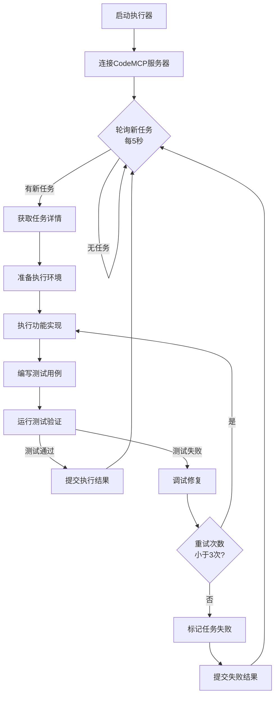

# CodeMCP Executor Skill


一个专业的AI协同编程执行器，负责从CodeMCP服务器获取开发任务、执行功能实现、运行测试验证、提交执行结果。作为CodeMCP多AI agent协作系统的核心执行者，实现自动化任务执行和智能错误恢复。

## 🎯 特性

### 🤖 智能任务执行
- **自动轮询**: 每隔5秒自动查询CodeMCP服务器获取新任务
- **智能任务获取**: 按优先级获取功能feature实现任务
- **状态同步**: 实时同步任务状态到服务器
- **任务队列管理**: 支持并发任务管理和执行

### 💻 代码实现与测试
- **全栈功能实现**: 支持前后端功能开发实现
- **测试驱动开发**: 自动编写并执行测试用例
- **测试验证**: 运行测试确保功能正确性
- **覆盖率检查**: 确保测试覆盖关键代码路径

### 🔄 自动化执行流程
- **环境自动准备**: 自动准备代码执行环境
- **依赖管理**: 智能检查并安装必要的依赖包
- **命令执行**: 执行开发、测试、构建等命令
- **结果验证**: 验证命令执行结果和退出码

### 🛡️ 智能错误处理
- **失败检测**: 智能检测任务执行失败
- **自动重试**: 支持任务失败自动重试（最多3次）
- **问题诊断**: 分析失败原因并提供修复建议
- **重新执行**: 修复问题后重新执行任务

### 📊 结果管理与报告
- **结果自动提交**: 将执行结果提交回CodeMCP服务器
- **状态更新**: 更新任务状态（成功/失败）
- **详细报告**: 生成详细的执行报告和日志
- **进度可视化**: 提供执行进度可视化展示

## 🚀 快速入门

### 安装
```bash
# 克隆项目
git clone https://github.com/openclaw/codemcp-executor-skill.git
cd codemcp-executor-skill

# 设置执行权限
chmod +x bin/* scripts/*.sh

# 安装到OpenClaw
cp -r . ~/tools/openclaw/skills/codemcp-executor
```

### 基本使用
```bash
# 1. 启动执行器服务（自动轮询模式）
./bin/codemcp-executor

# 2. 或者使用命令行模式
./bin/codemcp-executor check      # 检查环境和连接
./bin/codemcp-executor start      # 启动执行器服务
./bin/codemcp-executor fetch      # 手动获取任务
./bin/codemcp-executor status     # 查看执行器状态
```

### 5分钟示例
```bash
# 1. 配置CodeMCP服务器
export CODEMCP_SERVER_URL="http://localhost:8000"
export CODEMCP_API_KEY="your-api-key"

# 2. 启动执行器服务（后台运行）
./scripts/codemcp_executor.sh start --daemon

# 3. 查看执行器状态
./scripts/report_status.sh

# 4. 手动获取并执行任务
./scripts/fetch_task.sh --type feature --priority high

# 5. 监控执行进度
tail -f /var/log/codemcp-executor.log
```

## 📋 工作流程



## 🛠️ 核心组件

### 主命令行工具 (`bin/codemcp-executor`)
```bash
# 查看所有命令
codemcp-executor --help

# 连接管理
codemcp-executor connect     # 连接到CodeMCP服务器
codemcp-executor disconnect  # 断开连接
codemcp-executor test        # 测试连接状态

# 任务管理
codemcp-executor task fetch     # 获取新任务
codemcp-executor task list      # 列出待执行任务
codemcp-executor task execute   # 执行指定任务
codemcp-executor task status    # 查看任务状态

# 执行控制
codemcp-executor start      # 启动执行器服务
codemcp-executor stop       # 停止执行器服务
codemcp-executor restart    # 重启执行器服务
codemcp-executor status     # 查看执行器状态

# 监控与报告
codemcp-executor monitor    # 实时监控执行状态
codemcp-executor logs       # 查看执行日志
codemcp-executor report     # 生成执行报告
```

### 脚本工具 (`scripts/`)
- `codemcp_executor.sh` - 主工作流脚本
- `fetch_task.sh` - 任务获取脚本
- `execute_task.sh` - 任务执行脚本
- `run_tests.sh` - 测试运行脚本
- `submit_result.sh` - 结果提交脚本
- `monitor_loop.sh` - 监控循环脚本
- `check_connection.sh` - 连接检查脚本
- `report_status.sh` - 状态报告脚本
- `check_environment.sh` - 环境检查脚本
- `setup_workspace.sh` - 工作空间设置脚本
- `error_handler.sh` - 错误处理脚本

## 📁 项目结构

```
codemcp-executor-skill/
├── bin/                        # 可执行文件
│   └── codemcp-executor       # 主命令行工具
├── scripts/                    # 功能脚本
│   ├── codemcp_executor.sh    # 主工作流管理器
│   ├── fetch_task.sh          # 任务获取
│   ├── execute_task.sh        # 任务执行
│   ├── run_tests.sh           # 测试运行
│   ├── submit_result.sh       # 结果提交
│   ├── monitor_loop.sh        # 监控循环
│   ├── check_connection.sh    # 连接检查
│   ├── report_status.sh       # 状态报告
│   ├── check_environment.sh   # 环境检查
│   ├── setup_workspace.sh     # 工作空间设置
│   └── error_handler.sh       # 错误处理
├── examples/                   # 使用示例
│   ├── basic_task_execution/  # 基础任务执行
│   ├── feature_implementation/# 功能实现示例
│   ├── test_execution/        # 测试执行示例
│   └── error_recovery/        # 错误恢复示例
├── docs/                       # 文档
│   ├── api_reference.md       # API接口参考
│   ├── task_format.md         # 任务格式说明
│   ├── error_handling.md      # 错误处理指南
│   └── integration_guide.md   # 集成指南
├── assets/                     # 资源文件
│   ├── task_template.json     # 任务模板
│   ├── result_template.json   # 结果模板
│   └── config_template.json   # 配置模板
├── SKILL.md                    # 主技能文档
├── README.md                   # 项目说明文档
└── LICENSE                     # 许可证文件
```

## ⚙️ 配置

### 环境配置
创建配置文件 `~/.config/codemcp-executor/config.json`:
```json
{
  "server": {
    "url": "http://localhost:8000",
    "api_key": "your-api-key-here",
    "timeout": 30,
    "retry_attempts": 3
  },
  "executor": {
    "id": "executor-001",
    "name": "AI Code Executor",
    "role": "feature_implementation",
    "capabilities": ["coding", "testing", "debugging", "documentation"],
    "concurrent_tasks": 1
  },
  "polling": {
    "enabled": true,
    "interval": 5,
    "max_empty_polls": 10,
    "jitter": 2
  },
  "execution": {
    "max_retries": 3,
    "retry_delay": 10,
    "timeout": 300,
    "workspace_dir": "/tmp/codemcp-workspace",
    "cleanup_on_success": true,
    "keep_logs": true
  },
  "testing": {
    "framework": "pytest",
    "coverage_threshold": 80,
    "fail_fast": false,
    "verbose": true
  },
  "logging": {
    "level": "INFO",
    "file": "/var/log/codemcp-executor.log",
    "max_size_mb": 10,
    "backup_count": 5
  }
}
```

### 环境变量
```bash
# 服务器配置
export CODEMCP_SERVER_URL="http://localhost:8000"
export CODEMCP_API_KEY="your-api-key-here"

# 执行器配置
export EXECUTOR_ID="executor-001"
export EXECUTOR_NAME="AI Code Executor"
export EXECUTOR_ROLE="feature_implementation"

# 轮询配置
export POLL_INTERVAL=5
export MAX_RETRIES=3
export RETRY_DELAY=10

# 执行环境
export WORKSPACE_DIR="/tmp/codemcp-workspace"
export LOG_LEVEL="INFO"
```

## 🔧 集成示例

### 与CodeMCP Planner协同工作
```bash
# Planner创建任务
./bin/codemcp-planner task create \
  --type feature \
  --title "实现用户登录功能" \
  --description "实现用户登录页面和API接口"

# Executor自动获取并执行
./bin/codemcp-executor start --daemon
# 执行器会自动轮询、获取任务、执行、测试、提交结果
```

### 与coding-agent集成
```bash
# 在execute_task.sh中调用coding-agent进行代码实现
#!/bin/bash
TASK_ID=$1
TASK_DESCRIPTION=$(cat task.json | jq -r '.description')

# 调用coding-agent执行编码任务
coding-agent --task "$TASK_DESCRIPTION" \
  --output "./workspace/$TASK_ID" \
  --language python \
  --framework fastapi
```

### 自定义测试执行
```bash
# 支持多种测试框架配置
# Python pytest
./scripts/run_tests.sh --framework pytest --path tests/

# Node.js jest
./scripts/run_tests.sh --framework jest --path __tests__/

# 自定义命令
./scripts/run_tests.sh --command "npm run test:coverage"
```

## 📊 监控与报告

### 实时监控
```bash
# 查看执行器状态
./scripts/report_status.sh

# 实时监控日志
tail -f /var/log/codemcp-executor.log

# 监控任务队列
./scripts/monitor_loop.sh --watch
```

### 生成报告
```bash
# 生成今日执行报告
./bin/codemcp-executor report daily --output daily-report.md

# 生成任务统计报告
./bin/codemcp-executor report stats --period week

# 导出执行日志
./bin/codemcp-executor logs export --format json
```

## 🐛 故障排除

### 常见问题

#### 1. 无法连接到CodeMCP服务器
```bash
# 检查服务器状态
curl -v http://localhost:8000/health

# 测试连接
./scripts/check_connection.sh

# 查看详细错误
export LOG_LEVEL="DEBUG"
./bin/codemcp-executor connect
```

#### 2. 任务获取失败
```bash
# 检查API密钥
echo $CODEMCP_API_KEY

# 手动测试API调用
curl -H "Authorization: Bearer $CODEMCP_API_KEY" \
  http://localhost:8000/api/v1/tasks/next

# 查看服务器日志
tail -f /path/to/codemcp-server.log
```

#### 3. 测试执行失败
```bash
# 查看测试详细输出
./scripts/run_tests.sh --task-id TASK_001 --verbose

# 运行特定测试文件
pytest tests/test_login.py -xvs

# 检查测试环境
python -m pytest --collect-only tests/
```

#### 4. 依赖安装问题
```bash
# 检查Python环境
python --version
pip --version

# 手动安装依赖
pip install -r requirements.txt

# 使用虚拟环境
python -m venv venv
source venv/bin/activate
```

### 获取帮助
```bash
# 查看完整帮助
./bin/codemcp-executor --help

# 查看具体命令帮助
./bin/codemcp-executor task --help

# 查看脚本使用
./scripts/codemcp_executor.sh --help
```

## 🤝 贡献指南

### 开发环境设置
```bash
# 1. Fork并克隆项目
git clone https://github.com/your-username/codemcp-executor-skill.git
cd codemcp-executor-skill

# 2. 创建开发分支
git checkout -b feature/new-feature

# 3. 安装开发依赖
pip install -r requirements-dev.txt

# 4. 运行测试
./scripts/run_tests.sh --self-test
```

### 提交代码
1. 添加测试用例
2. 确保所有测试通过
3. 更新文档
4. 提交Pull Request

### 代码规范
- Shell脚本使用bash shebang和set -euo pipefail
- 添加详细的函数注释
- 遵循现有的代码风格
- 包含错误处理逻辑

## 📄 许可证

本项目采用 MIT 许可证 - 查看 [LICENSE](LICENSE) 文件了解详情。

## 📞 支持与反馈

- **问题报告**: [GitHub Issues](https://github.com/openclaw/codemcp-executor-skill/issues)
- **功能请求**: 通过GitHub Issues提交
- **文档改进**: 提交文档改进请求
- **社区讨论**: [Discussions](https://github.com/openclaw/codemcp-executor-skill/discussions)

## 🚀 路线图

### v1.1.0 (计划中)
- [ ] 支持多任务并发执行
- [ ] 添加Docker容器支持
- [ ] 优化性能监控和告警
- [ ] 增加更多测试框架支持

### v1.2.0 (规划中)
- [ ] 分布式执行器集群
- [ ] 机器学习优化执行策略
- [ ] 可视化监控界面
- [ ] 插件系统扩展

---

**版本**: 1.0.0
**最后更新**: 2026-03-17
**维护者**: OpenClaw AI Team
**文档**: [完整文档](docs/)
**示例**: [使用示例](examples/)