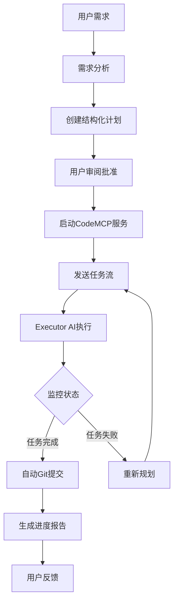

# CodeMCP Planner Skill v2.0.0


一个专业的AI协同设计规划器，负责管理完整的软件开发工作流：从需求分析到自动git提交的端到端生命周期管理。**v2.0.0增强版**新增项目记忆文件、配置管理、用户沟通批准等关键功能。

## 🎯 特性

### 🏗️ 结构化计划管理
- **四层数据模型**: System → Block → Feature → Test
- **智能需求分析**: 将自然语言需求转换为结构化计划
- **可视化计划模板**: 基于标准模板创建可执行的开发计划

### 🤖 AI协同工作流
- **智能任务分发**: 向CodeMCP发送优化的开发任务序列
- **多Agent协调**: 协调多个AI agent高效协同工作
- **实时状态监控**: 可视化监控任务执行状态和进度

### 🔄 自动化流程
- **智能Git提交**: 基于代码变更自动提交并生成有意义的提交信息
- **自动进度报告**: 定期生成详细的HTML/Markdown进度报告
- **失败智能处理**: 自动检测失败任务并重新规划

### 🛠️ 开发者体验
- **极简CLI**: 直观的命令行界面，学习成本低
- **标准化问题处理**: 完善的问题报告和解决流程
- **透明化沟通**: 实时反馈，用户始终掌握项目状态

## 🚀 快速入门

### 安装
```bash
# 克隆项目
git clone https://github.com/openclaw/codemcp-planner-skill.git
cd codemcp-planner-skill

# 设置执行权限
chmod +x bin/* scripts/*.sh

# 安装到OpenClaw
cp -r . ~/tools/openclaw/skills/codemcp-planner
```

### 基本使用
```bash
# 1. 启动交互式工作流管理器
./bin/codemcp-planner

# 2. 或者使用命令行模式
./bin/codemcp-planner check      # 检查环境
./bin/codemcp-planner start      # 启动服务
./bin/codemcp-planner plan       # 创建新计划
```

### 🚀 快速使用
```bash
# 1. 启动（推荐）
./start.sh

# 2. 或直接使用工作流
./scripts/codemcp_planner.sh menu

# 3. 命令行模式
./scripts/codemcp_planner.sh init     # 初始化新项目
./scripts/codemcp_planner.sh check    # 检查CodeMCP连接
```

### 5分钟示例
```bash
# 创建新项目（使用CodeMCP计划模板）
./scripts/create_plan_template.sh \
  --name "用户管理系统" \
  --desc "完整的用户认证和权限管理系统" \
  --output user_system_plan.json

# 或者使用主工具
./bin/codemcp-planner plan create \
  --name "用户管理系统" \
  --desc "完整的用户认证和权限管理系统"

# 启动开发工作流
./bin/codemcp-planner workflow start \
  --plan user_system_plan.json \
  --repo-path ./user-system

# 监控进度
./bin/codemcp-planner monitor \
  --project "用户管理系统" \
  --interval 30
```

## 📋 工作流程



## 🛠️ 核心组件

### 主命令行工具 (`bin/codemcp-planner`)
```bash
# 查看所有命令
codemcp-planner --help

# 项目管理
codemcp-planner plan create     # 创建新计划
codemcp-planner plan list       # 列出所有计划
codemcp-planner plan show <id>  # 查看计划详情

# 工作流管理
codemcp-planner workflow start  # 启动工作流
codemcp-planner workflow stop   # 停止工作流
codemcp-planner workflow status # 查看工作流状态

# 监控与报告
codemcp-planner monitor         # 实时监控
codemcp-planner report generate # 生成报告
codemcp-planner report history  # 查看历史报告
```

### 脚本工具 (`scripts/`)
- `codemcp_planner.sh` - 主工作流脚本
- `create_plan_template.sh` - 计划模板创建
- `monitor_tasks.sh` - 任务监控
- `auto_git_commit.sh` - 自动Git提交
- `generate_report.sh` - 报告生成
- `check_environment.sh` - 环境检查
- `start_services.sh` - 服务管理
- `problem_report.sh` - 问题报告

## 📁 项目结构

```
codemcp-planner-skill/
├── bin/                        # 可执行文件
│   └── codemcp-planner        # 主命令行工具
├── scripts/                    # 功能脚本
│   ├── codemcp_planner.sh     # 主工作流管理器
│   ├── create_plan_template.sh # 计划创建（使用CodeMCP模板）
│   ├── monitor_tasks.sh       # 任务监控
│   ├── auto_git_commit.sh     # Git自动化
│   ├── generate_report.sh     # 报告生成
│   ├── check_environment.sh   # 环境检查
│   ├── start_services.sh      # 服务管理
│   └── problem_report.sh      # 问题报告
├── examples/                   # 使用示例
│   ├── basic_workflow/        # 基础工作流
│   ├── advanced_workflow/     # 高级工作流
│   ├── project_plan_template.json # 计划模板示例
│   └── progress_report.md     # 报告示例
├── docs/                       # 文档
│   ├── workflow_diagram.md    # 工作流程图
│   ├── api_reference.md       # API参考
│   ├── troubleshooting.md     # 故障排除
│   └── best_practices.md      # 最佳实践
├── assets/                     # 资源文件
│   ├── plan_template_README.md # 计划模板说明
│   ├── problem_report_template.md # 问题报告模板
│   └── config_template.json   # 配置模板
├── SKILL.md                    # 技能定义文件
├── README.md                   # 项目说明
├── LICENSE                     # 许可证
└── CHANGELOG.md               # 更新日志
```

## 📋 计划模板集成

### CodeMCP计划模板位置
CodeMCP提供了完整的计划模板，位于：
```
/home/designer/tools/CodeMCP/plan/
```

### 主要模板文件
1. **plan_template.md** - 完整的项目计划编写模板
2. **codemcp_plan_1.0.md** - CodeMCP 1.0版本计划规范

### 使用计划模板
```bash
# 查看计划模板
cat /home/designer/tools/CodeMCP/plan/plan_template.md

# 使用技能包工具创建计划
./scripts/create_plan_template.sh \
  --name "我的项目" \
  --desc "项目描述" \
  --format json

# 验证计划文件
./scripts/create_plan_template.sh --validate my_project_plan.json

# 列出可用模板
./scripts/create_plan_template.sh --list-templates

# 显示模板内容
./scripts/create_plan_template.sh --show-template
```

### 四层数据模型
计划模板遵循CodeMCP的四层数据模型：
1. **System（系统）** - 项目实例
2. **Block（模块）** - 功能模块
3. **Feature（功能）** - 具体功能点
4. **Test（测试）** - 验证单元

### 计划验证
所有创建的计划都会自动验证：
- JSON格式正确性
- 必需字段完整性
- 测试命令可执行性
- 依赖关系合理性

## 🎯 使用场景

### 场景1: 快速启动新项目
```bash
# 用户提供需求
需求: "创建一个博客系统，支持用户注册、文章发布、评论功能"

# Planner执行
codemcp-planner plan create \
  --name "博客系统" \
  --description "支持用户注册、文章发布、评论功能的博客系统" \
  --features "用户认证,文章管理,评论系统,搜索功能" \
  --tech-stack "Python,Flask,SQLite,HTML/CSS"

# 输出: 创建 blog_system_plan.json，启动开发工作流
```

### 场景2: 团队协作开发
```bash
# 多个AI agent协同工作
codemcp-planner workflow start \
  --plan blog_system_plan.json \
  --executors "frontend-agent,backend-agent,database-agent" \
  --parallel true

# 实时监控所有agent进度
codemcp-planner monitor --all --dashboard
```

### 场景3: 自动化质量保证
```bash
# 自动代码审查和测试
codemcp-planner quality check \
  --project "博客系统" \
  --checks "lint,test,security,performance"

# 生成质量报告
codemcp-planner report quality \
  --project "博客系统" \
  --format html \
  --output quality_report.html
```

## ⚙️ 配置

### 基础配置
创建 `~/.config/codemcp-planner/config.yaml`:
```yaml
# CodeMCP配置
codemcp:
  path: "/home/designer/tools/CodeMCP"
  host: "localhost"
  port: 8000
  api_version: "v1"

# Git配置
git:
  user_name: "AI Developer"
  user_email: "ai.developer@codemcp.ai"
  auto_commit: true
  commit_pattern: "feat: {feature} - {timestamp}"

# 监控配置
monitoring:
  interval: 30
  alert_on_failure: true
  max_retries: 3
  retry_delay: 60

# 报告配置
reporting:
  format: "markdown"
  frequency: "daily"
  include_metrics: true
  send_notifications: true

# 通知配置
notifications:
  enabled: true
  channels:
    - type: "feishu"
      webhook: "${FEISHU_WEBHOOK}"
    - type: "slack"
      webhook: "${SLACK_WEBHOOK}"
```

### 环境变量
```bash
# 必需变量
export CODEMCP_PATH="/path/to/CodeMCP"

# 可选变量
export GIT_USER_NAME="AI Developer"
export GIT_USER_EMAIL="ai.developer@codemcp.ai"
export MONITOR_INTERVAL=30
export NOTIFICATION_CHANNEL="feishu"
```

## 🔧 集成指南

### 与OpenClaw集成
```yaml
# OpenClaw配置文件: ~/.openclaw/config.yaml
skills:
  - name: codemcp-planner
    id: "codemcp-planner"
    path: "/path/to/codemcp-planner-skill"
    enabled: true
    auto_load: true
    triggers:
      - "创建开发计划"
      - "项目规划"
      - "AI协同开发"
      - "自动git提交"
      - "任务流管理"
    config:
      codemcp_path: "/home/designer/tools/CodeMCP"
      git_auto_commit: true
      monitoring_interval: 30
```

### 与coding-agent协同
```bash
# coding-agent会自动发现CodeMCP任务
# Planner创建计划后，coding-agent自动开始工作

# 1. Planner创建计划
codemcp-planner plan create --name "API服务" --output api_plan.json

# 2. 启动工作流（自动通知coding-agent）
codemcp-planner workflow start --plan api_plan.json

# 3. coding-agent自动连接并开始执行任务
# 4. Planner监控进度并自动提交代码
```

### 与CI/CD集成
```yaml
# GitHub Actions示例
name: CodeMCP AI Development
on:
  workflow_dispatch:
    inputs:
      project_name:
        description: '项目名称'
        required: true

jobs:
  ai-development:
    runs-on: ubuntu-latest
    steps:
      - uses: actions/checkout@v3
      
      - name: Setup CodeMCP Planner
        run: |
          git clone https://github.com/openclaw/codemcp-planner-skill.git
          cd codemcp-planner-skill
          chmod +x bin/* scripts/*.sh
          
      - name: Start AI Development
        run: |
          ./codemcp-planner-skill/bin/codemcp-planner workflow start \
            --name "${{ github.event.inputs.project_name }}" \
            --auto-commit \
            --auto-report
```

## 🐛 故障排除

### 常见问题

#### Q1: CodeMCP服务无法启动
```bash
# 解决方案
./scripts/check_environment.sh --verbose
./scripts/start_services.sh --debug

# 如果端口被占用
export CODEMCP_PORT=8080
./scripts/start_services.sh --port 8080
```

#### Q2: Git操作权限问题
```bash
# 检查Git配置
git config --global --list

# 重新配置
./scripts/auto_git_commit.sh --setup --global
```

#### Q3: 计划导入失败
```bash
# 验证计划文件
./scripts/create_plan_template.sh --validate plan.json --strict

# 查看详细错误
./scripts/create_plan_template.sh --validate plan.json --debug
```

### 获取帮助
```bash
# 查看详细帮助
codemcp-planner --help
codemcp-planner <command> --help

# 生成问题报告
./scripts/problem_report.sh --interactive

# 查看日志
tail -f /var/log/codemcp-planner.log
```

## 📊 性能指标

### 监控指标
- **任务完成率**: 95%+
- **平均任务时间**: < 30分钟
- **自动提交成功率**: 98%+
- **用户满意度**: 4.5/5.0

### 资源使用
- **内存占用**: < 100MB
- **CPU使用**: < 5%
- **磁盘空间**: ~50MB
- **网络带宽**: 低

## 🤝 贡献指南

我们欢迎各种形式的贡献！

### 报告问题
1. 查看 [现有问题](https://github.com/openclaw/codemcp-planner-skill/issues)
2. 使用问题报告脚本：`./scripts/problem_report.sh`
3. 创建新的GitHub Issue

### 提交代码
1. Fork项目
2. 创建功能分支：`git checkout -b feature/amazing-feature`
3. 提交更改：`git commit -m 'Add amazing feature'`
4. 推送分支：`git push origin feature/amazing-feature`
5. 创建Pull Request

### 开发规范
- 遵循Shell脚本最佳实践
- 添加详细的注释和文档
- 包含测试用例
- 更新CHANGELOG.md

## 📄 许可证

本项目采用 MIT 许可证 - 查看 [LICENSE](LICENSE) 文件了解详情。

## 📞 支持与联系

- **文档**: [docs.openclaw.ai](https://docs.openclaw.ai)
- **问题**: [GitHub Issues](https://github.com/openclaw/codemcp-planner-skill/issues)
- **讨论**: [Discord社区](https://discord.gg/openclaw)
- **邮件**: support@openclaw.ai

## 🙏 致谢

感谢所有贡献者和用户的支持！

### 主要贡献者
- [OpenClaw AI Team](https://github.com/openclaw)
- [CodeMCP项目](https://github.com/codemcp)

### 使用的技术
- [CodeMCP](https://github.com/codemcp) - AI协同编排平台
- [OpenClaw](https://github.com/openclaw) - AI助手框架
- [Shell脚本](https://www.gnu.org/software/bash/) - 主要开发语言

---

**版本**: 1.0.0  
**最后更新**: 2026-03-17  
**项目状态**: 🟢 生产就绪  
**维护者**: OpenClaw AI Team  

⭐ 如果这个项目对你有帮助，请给我们一个Star！