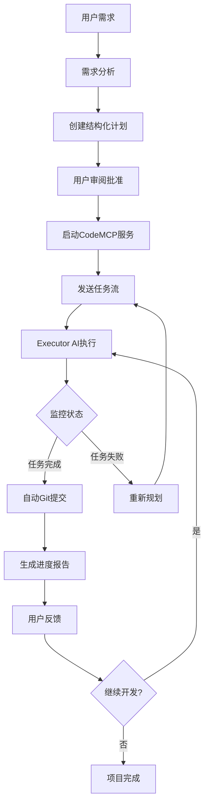
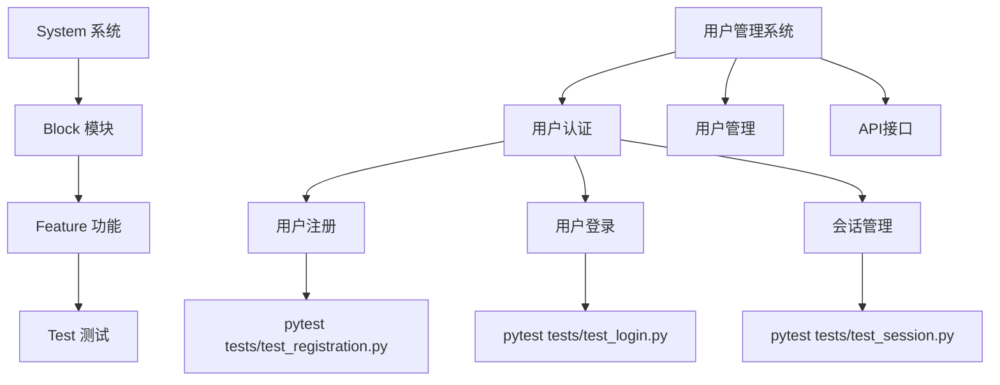
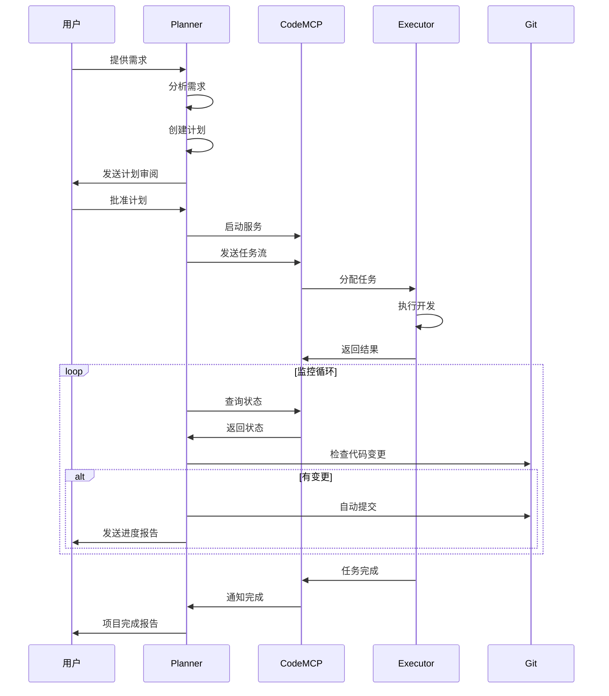
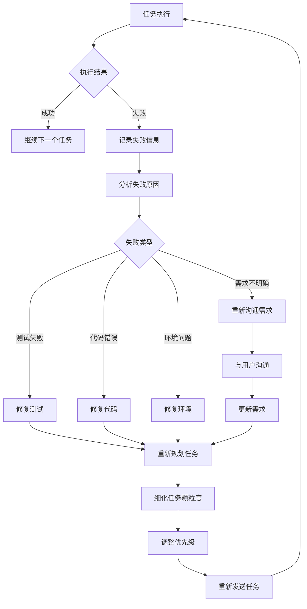
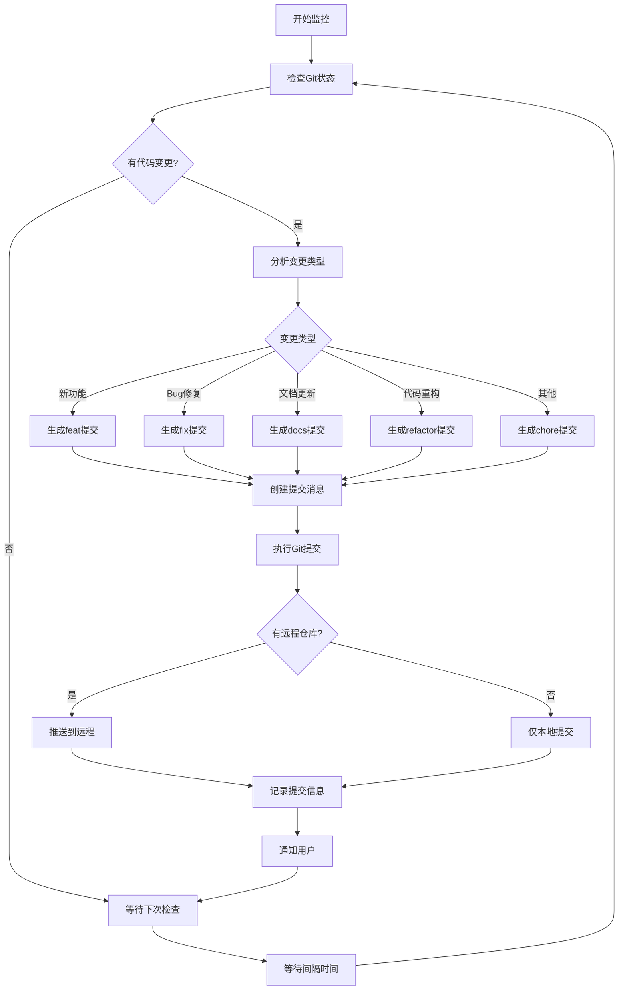
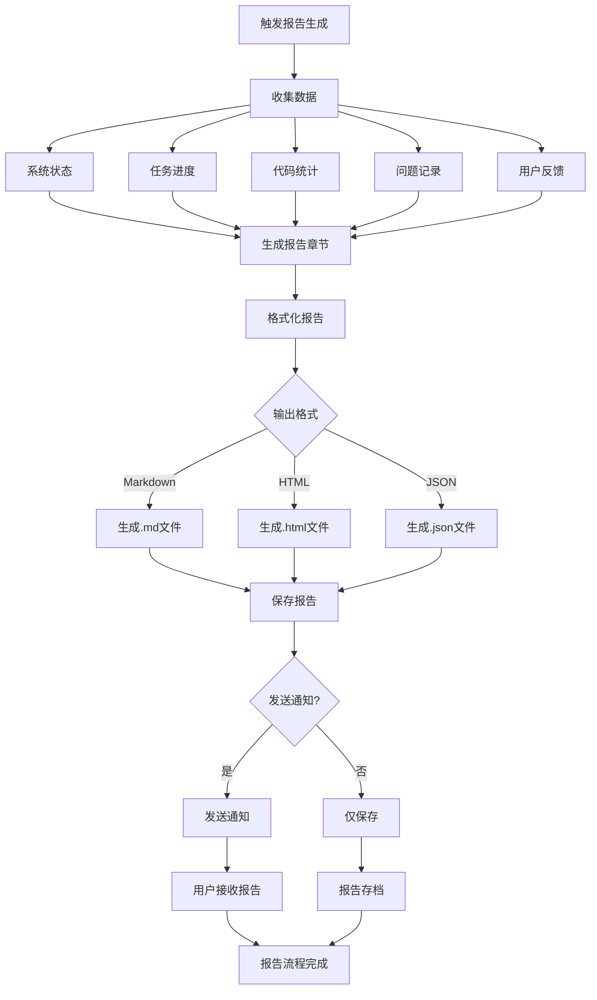
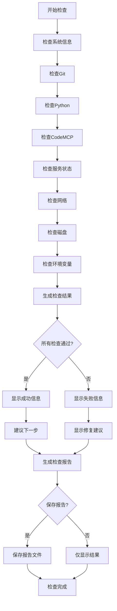
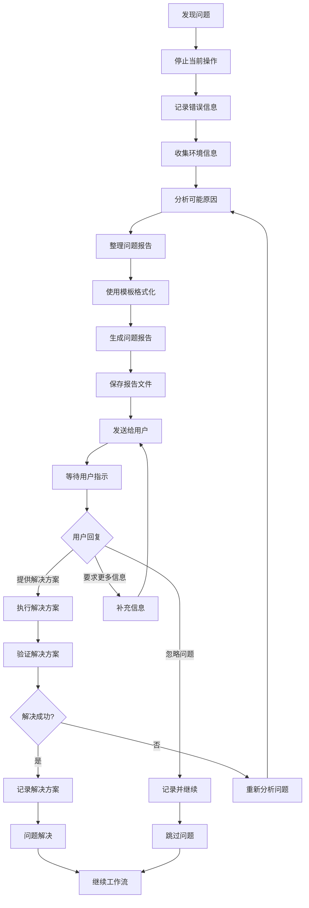
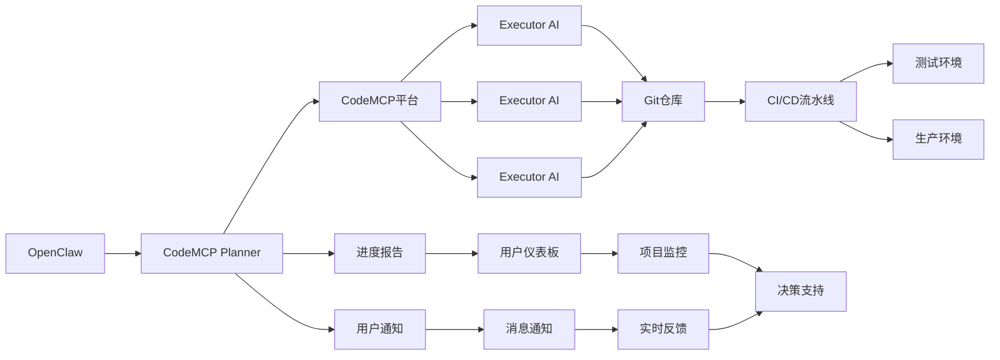

# 工作流程图

## 整体工作流

## 四层数据模型

## 任务执行流程

## 失败处理流程

## 自动Git提交流程

## 进度报告生成流程

## 环境检查流程

## 问题报告流程

## 集成工作流

这个文档提供了CodeMCP Planner Skill的完整工作流程图，包括：
1. 整体工作流
2. 四层数据模型
3. 任务执行流程
4. 失败处理流程
5. 自动Git提交流程
6. 进度报告生成流程
7. 环境检查流程
8. 问题报告流程
9. 集成工作流

所有图表都使用Mermaid语法，可以在支持Mermaid的Markdown查看器中正确显示。